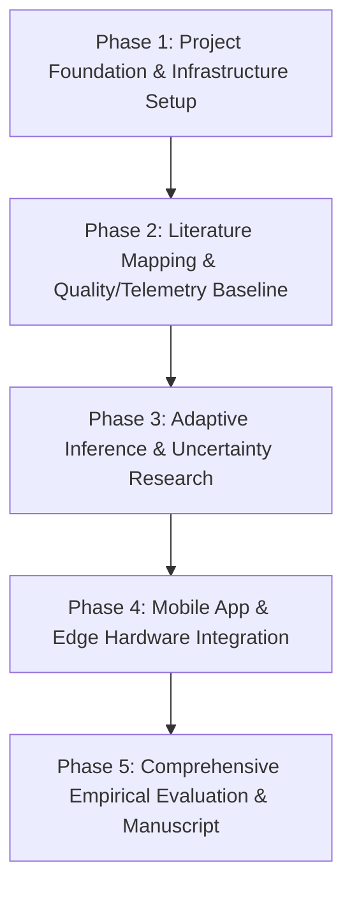

# PocketInspect: Project Specification

## 1. System Overview & Vision

**PocketInspect** is an experimental, adaptive, resource-aware Edge AI visual inspection system designed to repurpose legacy and low-cost smartphones into autonomous industrial-grade visual inspection devices. 

By taking advantage of modern mobile hardware (multi-core ARM CPUs, embedded GPUs, NPUs, high-resolution camera sensors, and rich thermal/battery sensors), PocketInspect addresses the high cost and rigidity of traditional fixed industrial machine vision systems.

### Initial Target Application
- **Primary Domain**: Visual inspection of 3D-printed parts (e.g., FDM/SLA artifacts) and small manufactured components.
- **Key Inspection Tasks**: Surface defect identification (under-extrusion, stringing, layer shifting, warping, dimensional anomalies), scratch/crack detection, and surface anomaly scoring.

---

## 2. Roles of the Repurposed Smartphone

In PocketInspect, the smartphone functions as a unified edge device fulfilling five core operational roles:

1. **Optical Acquisition Camera**: Capturing multi-angle high-resolution macro imagery of target parts under varying lighting conditions.
2. **Edge Computing Node**: Running real-time image processing, preprocessing, and feature extraction directly on-device without cloud dependency.
3. **AI Inference Platform**: Executing compressed, lightweight deep learning models (via TFLite / ONNX Runtime) accelerated by mobile GPUs/NPUs.
4. **Interactive Inspection Interface**: Providing instantaneous visual feedback, bounding boxes, anomaly heatmaps, and operator alerts via an intuitive mobile UI.
5. **Hardware/Resource Monitoring Platform**: Continuously sensing device thermal levels, battery discharge rates, CPU/GPU throttling states, and memory pressure to dynamically adapt inference workloads.

---

## 3. Scope of Research Dimensions

PocketInspect explores the intersection of several active research domains:

- **Mobile & Edge AI**: On-device neural network execution under severe compute and power constraints.
- **Industrial Visual Inspection**: Computer vision algorithms tailored for quality assurance in small-scale additive and subtractive manufacturing.
- **3D-Print Defect Detection**: Domain-specific defect taxonomies (layer misalignments, infill voids, surface roughness).
- **Lightweight Deep Learning & Model Compression**: Quantization (INT8/FP16), pruning, knowledge distillation, and efficient backbone selection (MobileNet, EfficientNet, MobileViT).
- **Adaptive & Resource-Aware Inference**: Dynamic resolution scaling, frame-skipping, conditional computation, and model switching driven by real-time device telemetry.
- **Thermal & Energy-Aware Computing**: Mitigating thermal throttling and maximizing battery longevity during continuous inspection cycles.
- **Multi-View Inspection**: Aggregating information across multiple camera angles or sequential frames.
- **Uncertainty Estimation & Anomaly Detection**: Calibrating prediction confidence and detecting out-of-distribution (OOD) defects using unsupervised or semi-supervised approaches.

---

## 4. Subsystem & Module Architecture (`src/`)

The core Python library under `src/` is structured into seven decoupled, specialized modules:

```
src/
├── acquisition/    # Camera interfaces, frame capture control, camera metadata parsing
├── quality/        # Image quality assessment (blur, exposure, contrast, alignment validation)
├── inference/      # Model execution engine abstractions (ONNX Runtime, TFLite wrappers)
├── adaptation/     # Resource-aware dynamic execution control & policy engines
├── inspection/     # Defect classification, segmentation, and anomaly scoring algorithms
├── uncertainty/    # Model confidence calibration, OOD detection, uncertainty scoring
└── monitoring/     # Device telemetry parsing (CPU/GPU load, thermals, power, memory)
```

### Module Responsibilities

1. **`src/acquisition/`**:
   - Manages frame capture pipelines, camera parameter constraints (ISO, shutter speed, focus distance), and image buffer ingest.

2. **`src/quality/`**:
   - Assesses incoming frames prior to neural inference to filter out blurred, poorly lit, or misaligned captures, saving compute energy.

3. **`src/inference/`**:
   - Provides runtime-agnostic inference wrappers supporting INT8/FP16 models across CPU, GPU, and NPU execution providers.

4. **`src/adaptation/`**:
   - Implements resource-aware adaptation policies. Adjusts input resolution, model precision, or model variant selection based on feedback from `monitoring`.

5. **`src/inspection/`**:
   - Implements core visual inspection heads, defect bounding box formatting, anomaly map generation, and component pass/fail logic.

6. **`src/uncertainty/`**:
   - Computes epistemic/aleatoric uncertainty metrics to flag ambiguous defects for manual human operator review.

7. **`src/monitoring/`**:
   - Collects system metrics (temperature sensors, battery status, memory footprint, inference frame latency) across desktop simulation and mobile environments.

---

## 5. Non-Functional & System Requirements

- **System Portability**: Clean separation between desktop research evaluation scripts (`experiments/`) and mobile deployment packages (`mobile/`).
- **Thermal Sustainability**: Ability to run continuous inspection workloads without triggering OS-level emergency thermal shutdown.
- **Configuration Declarativeness**: Zero hardcoded thresholds; all policies, path mappings, and model parameters reside in `configs/`.
- **Scientific Reproducibility**: Deterministic random seed management, environment locking, and immutable experiment run logs stored in `research/results/`.

---

## 6. Phased Research Roadmap



1. **Phase 1: Project Foundation & Architecture** (Current Phase)
   - Establish directory structure, research rules, configuration schemas, and modular code skeletons.
2. **Phase 2: Hardware Telemetry & Quality Pre-filtering**
   - Implement resource monitoring abstractions and image quality pre-filtering modules (`quality/` and `monitoring/`).
3. **Phase 3: Adaptive Edge Inference & Uncertainty Modeling**
   - Benchmark lightweight backbones, design resource adaptation policies, and implement uncertainty estimation (`inference/`, `adaptation/`, `uncertainty/`).
4. **Phase 4: Mobile Client & Hardware-in-the-Loop Integration**
   - Develop native/cross-platform Android harness in `mobile/` and link on-device sensor telemetry with model execution.
5. **Phase 5: Empirical Benchmarking & Manuscript Preparation**
   - Conduct systematic experiments across physical device testbeds, document findings in `research/results/`, and assemble paper data in `research/manuscript_data/`.
